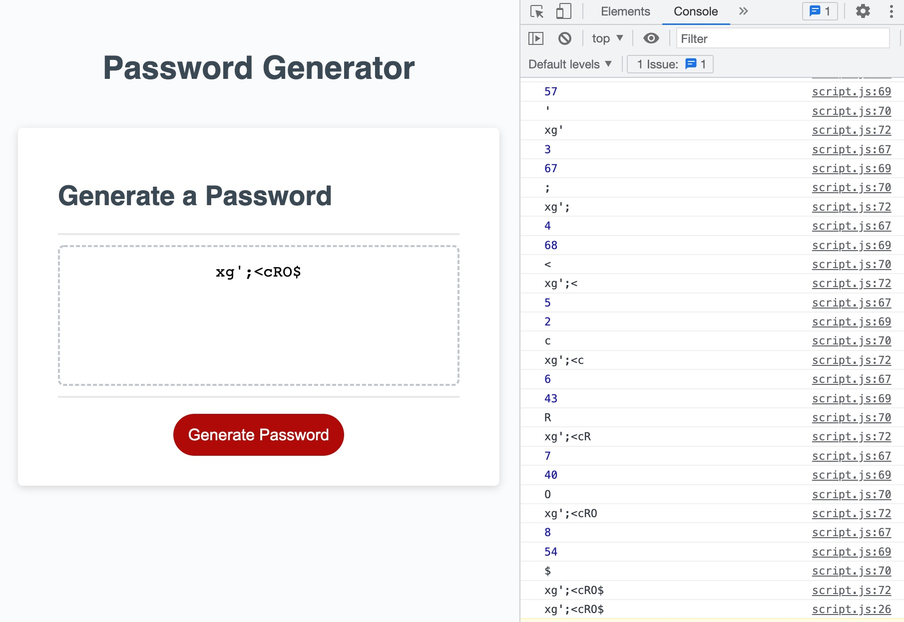

# Project Name: Password Generator

## Description
[Deployed Site](https://dstelzl.github.io/password-generator/)

I created an application that users can generate random passwords using a combination of upper and lowercase letters, numbers and special characters. Using pre-existing code as a start to the project- I added variables that identified what the character sets could be as well as functions that selected random characters based on the users selection of type of character and password length. I console.log(ged) along the way to make sure the application was operating correctly and captured those results in the visual below.

## Visuals

## Contributions
created by Deborah Stelzl

